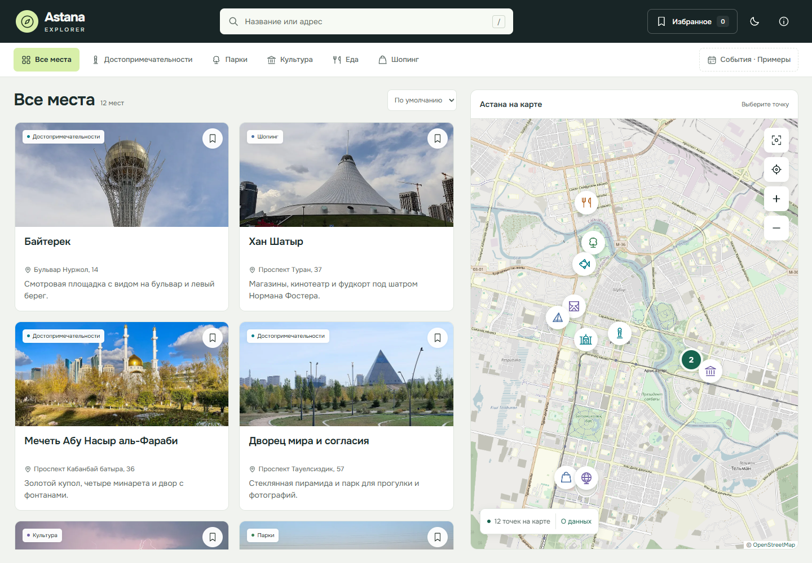

# Astana Explorer

Пет-проект для фронтенд-портфолио: карта Астаны с поиском мест, категориями и избранным. HTML, CSS и JavaScript без фреймворка и шага сборки; Leaflet и кластеризация маркеров подключены локально.

[](docs/screenshots/desktop.png)

Скриншоты: [настольная версия](docs/screenshots/desktop.png) · [мобильная версия](docs/screenshots/mobile.png). [Архитектура и решения фронтенда](docs/frontend.md).

## Интерфейс

- Основное представление — каталог с фотографиями мест, названием, адресом и описанием до двух строк. На компьютере карточки расположены в двух колонках, карта занимает правую часть экрана.
- Поиск находится в шапке; `/` переводит к нему фокус. Все категории видны в общей панели и переносятся на следующую строку.
- Выбранное место раскрывается под картой в немодальной панели. Каталог остаётся доступным; выбор другой карточки обновляет подробности, центрирует карту и раскрывает кластер. В очень низком окне подробности переходят в отдельное модальное окно, чтобы название и действия помещались на экране.
- Закрытие и переход к предыдущему или следующему месту текущей выдачи закреплены сверху, маршрут и действия — снизу. На границах списка соответствующая кнопка отключена.
- На телефоне первым открывается список с одной колонкой карточек, а нижний переключатель показывает карту. Подробности открываются в модальной нижней панели. В коротком окне карточки становятся горизонтальными, чтобы название и действия помещались на экране.
- По умолчанию показаны 12 реальных мест. Три демонстрационных события доступны через отдельный фильтр или среди сохранённых записей в избранном.
- Светлые тёплые поверхности, тёмные заголовки, зелёный акцент и светлая/тёмная темы. Вариативный Onest загружается локально из WOFF2, с системным шрифтом в качестве резервного. Тема следует системе до ручного выбора.

## Поведение фронтенда

- Поиск, фильтры и сортировка задают общие результаты списка и карты. Закрытие подробностей и сохранение места сохраняют контекст и фокус.
- Избранное и тема сохраняются в `localStorage` и синхронизируются между вкладками. Повреждённое или запрещённое хранилище не мешает просмотру.
- Ссылка вида `#place=baiterek` открывает нужное место. «Поделиться» копирует ссылку; при отказе браузера показывает поле для ручного копирования.
- Каталог работает до загрузки карты и при её сбое. Для карты предусмотрены сообщение об ошибке и повторная загрузка.
- Клавиатурная навигация, Escape, возврат фокуса, объявления результатов для скринридеров, безопасные зоны и уменьшение движения.

## Запуск

Нужен Node.js 20 или новее. Установка npm-зависимостей для запуска приложения не требуется.

```sh
npm start
```

Откройте http://127.0.0.1:4173. Сервер доступен только на этом компьютере. Если порт занят, остановите предыдущий сервер или задайте `PORT`. Подойдёт и другой статический сервер. Геолокация требует localhost или HTTPS и разрешения браузера.

## Каталог и источники

В подборке **12 реальных мест и 3 вымышленных примера событий**. Названия, адреса и координаты вручную проверены 5 октября 2026 года. Источники каждой точки, назначения маршрутов и ограничения описаны в [проверке каталога](docs/catalogue.md); записи находятся в [data.js](data.js).

Маркер обозначает объект или территорию, а не проверенный вход. В карточке доступны источник, назначение точки и дата проверки. Поиск учитывает старые названия, адреса, описание, категории и теги. Сфера Нур Алем описана с учётом alem.ai; Line Brew — конкретный филиал на Кенесары.

Маршрут открывает Google Maps с полным названием, адресом и проверенным Place ID. Начальную точку и способ передвижения пользователь выбирает там; приложение не запрашивает геолокацию для построения маршрута. Примеры событий связаны с реальными площадками через `venueId` и ведут к ним.

События явно отмечены как примеры: актуальные даты, организаторы, цены и билеты не подключены. Для живой афиши нужен проверенный API или редакционный источник.

В `assets/photos/` находятся 11 лицензированных фотографий из Wikimedia Commons, уменьшенных и сохранённых в WebP. Автор, источник, лицензия и обработка указаны в подробностях места и [списке фотографий](docs/image-credits.md). Для Line Brew нет проверенного снимка именно этого филиала, поэтому используется значок категории. При ошибке загрузки фотографии остаются название, описание и действия. Демособытия используют фото своей реальной площадки.

Onest хранится в `assets/fonts/` тремя поднаборами: Latin, Cyrillic и Cyrillic Extended, суммарно около 60 КБ. Лицензия — [SIL Open Font License](assets/fonts/OFL.txt); во время работы запросов к внешним сервисам шрифтов нет. Тайлы поступают из OpenStreetMap без API-ключа; их доступность и внешние маршруты зависят от сети.

## Проверка

Проверка синтаксиса без установки зависимостей:

```sh
npm run check
```

Браузерные проверки:

```sh
npm ci
npx playwright install chromium
npm test
```

В Windows Playwright автоматически использует установленный Microsoft Edge: скачивание Chromium можно пропустить. Другой Chromium-совместимый браузер задаётся через `PLAYWRIGHT_EXECUTABLE_PATH`. Интерактивный запуск — `npm run test:ui`.

Сценарии покрывают настольные и мобильные размеры от 320×400, доступность с axe, клавиатуру, поиск, сортировку, избранное между вкладками, ссылки на карточки, геолокацию и восстановление карты. Проверки компоновки контролируют видимый текст внутри карточек и доступность действий, а не только размеры контейнеров. Реальная загрузка OSM проверяется отдельным smoke-сценарием в каждом проекте; ожидания карты в проверках темы, адаптивности и таймаута используют локальный PNG. Трассировки и снимки ошибок — в `test-results/`, локальные диагностики — в `.qa/`; оба каталога игнорируются Git.

Автоматизация Chromium не заменяет проверку на физическом телефоне, с VoiceOver/TalkBack и реальной геолокацией. Подробные границы проекта — в [документации фронтенда](docs/frontend.md#ограничения).
